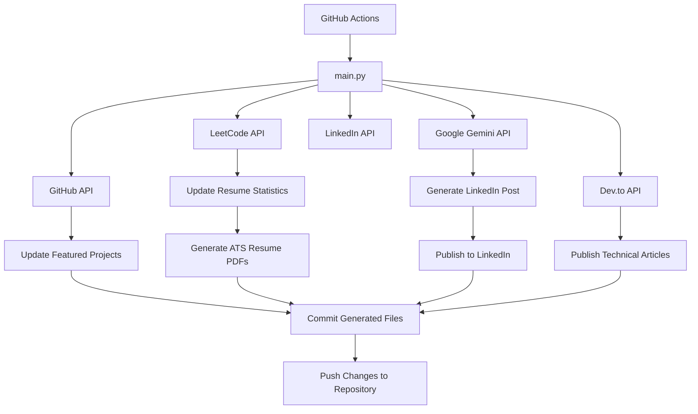
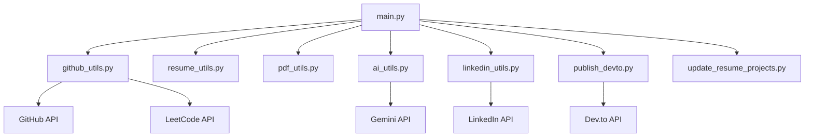
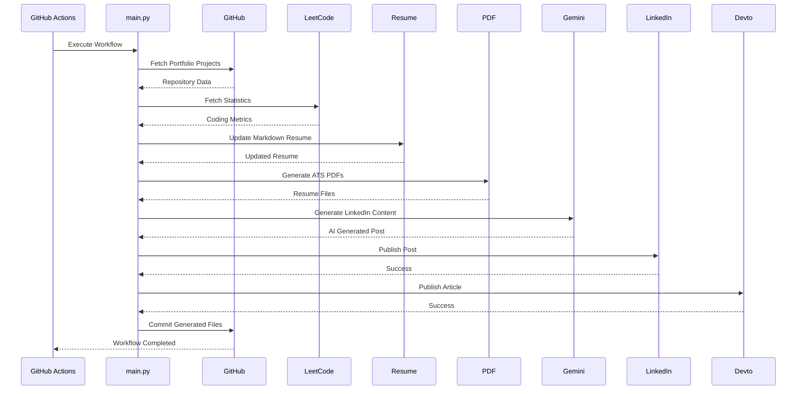

# 🚀 Portfolio Automation Framework

<p align="center">


</p>

> **An AI-powered automation framework that continuously synchronizes a developer's portfolio, GitHub projects, coding statistics, resume, technical articles, and professional profiles.**

Instead of manually updating resumes, PDFs, LinkedIn posts, Dev.to articles, GitHub repositories, and portfolio projects after every achievement, this framework automates the entire workflow using **GitHub Actions**, **Python**, **Google Gemini**, and multiple developer platform APIs.

The goal is simple:

> **Build software, not repetitive updates.**

---

# 📖 Table of Contents

- [Why I Built This](#-why-i-built-this)
- [Project Overview](#-project-overview)
- [Key Features](#-key-features)
- [Architecture](#-architecture)
- [Automation Workflow](#-automation-workflow)
- [Module Dependency Graph](#-module-dependency-graph)
- [Project Structure](#-project-structure)
- [Technology Stack](#-technology-stack)
- [Installation](#-installation)
- [Configuration](#-configuration)
- [GitHub Secrets](#-github-secrets)
- [GitHub Actions Workflow](#-github-actions-workflow)
- [Screenshots](#-screenshots)
- [Roadmap](#-roadmap)
- [Contributing](#-contributing)
- [License](#-license)

---

# 🎯 Why I Built This

As a Computer Science student preparing for placements, I realized that maintaining a professional developer portfolio required a surprising amount of repetitive work.

Every completed project meant updating:

- GitHub repositories
- Resume
- ATS PDF resumes
- LinkedIn profile
- Dev.to articles
- Portfolio website
- LeetCode statistics

Most of these tasks involved copying the same information across multiple platforms.

Rather than spending time on repetitive maintenance, I built an automation framework that keeps everything synchronized automatically.

Now, whenever I build something new or improve my coding profile, the automation pipeline updates my professional presence with minimal manual effort.

This project combines CI/CD practices with AI-powered content generation to solve a real productivity problem faced by many developers.

---

# 🌟 Project Overview

Portfolio Automation Framework is a modular Python application executed through **GitHub Actions**.

It automatically:

- Fetches coding statistics
- Updates resume content
- Generates ATS-friendly PDF resumes
- Generates LinkedIn posts using Gemini AI
- Publishes content to LinkedIn
- Publishes technical articles to Dev.to
- Synchronizes GitHub portfolio projects
- Commits generated files back to the repository

The entire process runs automatically on scheduled workflows or whenever new changes are pushed to the repository.

---

# ✨ Key Features

## 🤖 AI Automation

- AI-generated LinkedIn posts using Google Gemini
- Professional writing style
- Technical and authentic tone
- Custom prompt engineering

---

## 📄 Resume Automation

- Automatic Markdown resume updates
- Dynamic LeetCode statistics
- ATS-friendly PDF generation
- Multiple resume variants
    - Full Stack
    - Backend

---

## 💻 Portfolio Synchronization

- Automatic GitHub project ranking
- Featured project selection
- Resume project updates
- Portfolio project synchronization

---

## 📈 Coding Statistics

- Live LeetCode statistics
- Easy / Medium / Hard breakdown
- Global ranking
- Automatic profile updates

---

## ✍️ Content Publishing

- LinkedIn publishing
- Dev.to publishing
- AI-assisted technical writing
- Automated content generation

---

## ⚙️ CI/CD Automation

- GitHub Actions workflow
- Scheduled execution
- Push-triggered automation
- Automatic commits
- Repository synchronization

---

# 🚀 Project Highlights

✔ Modular architecture

✔ Clean separation of responsibilities

✔ API-driven design

✔ AI integration

✔ Resume automation

✔ ATS PDF generation

✔ GitHub Actions CI/CD

✔ Professional documentation

✔ Open-source friendly structure

✔ Easily extensible

---

# 💡 Design Philosophy

This project follows one simple principle:

> **Developers should spend their time building software—not repeatedly updating documentation and professional profiles.**

By automating repetitive portfolio maintenance, the framework allows developers to focus on learning, building, and shipping projects while ensuring that their professional presence always stays up to date.

---

---

# 🏗️ Architecture

The Portfolio Automation Framework follows a modular, automation-first architecture where each component is responsible for a single task. GitHub Actions orchestrates the entire workflow while individual Python modules handle data collection, content generation, resume compilation, and publishing.



---

# ⚙️ Automation Workflow

Every execution follows a deterministic pipeline. Each stage depends on the successful completion of the previous stage.

```mermaid
flowchart LR

A[Workflow Trigger]

A --> B[Fetch GitHub Projects]

B --> C[Fetch LeetCode Stats]

C --> D[Update resume.md]

D --> E[Generate ATS PDFs]

E --> F[Generate LinkedIn Content]

F --> G[Publish LinkedIn Post]

G --> H[Publish Dev.to Article]

H --> I[Commit Files]

I --> J[Push to GitHub]
```



---

# 🧩 Module Dependency Graph

Each module is responsible for exactly one domain, making the project easier to maintain and extend.



---

# 🔄 Execution Sequence

The following sequence diagram illustrates how the automation pipeline executes during every GitHub Actions run.



---

# 📂 Project Structure

```text
Portfolio-Automation-Framework
│
├── .github/
│   └── workflows/
│       ├── automation.yml
│       └── devto-publisher.yml
│
├── scripts/
│   ├── main.py
│   ├── config.py
│   ├── utils.py
│   ├── github_utils.py
│   ├── ai_utils.py
│   ├── resume_utils.py
│   ├── pdf_utils.py
│   ├── linkedin_utils.py
│   ├── publish_devto.py
│   └── update_resume_projects.py
│
├── posts/
│
├── resume.md
│
├── requirements.txt
│
├── README.md
│
└── LICENSE
```

---

# 📦 Module Responsibilities

| Module | Responsibility |
|---------|----------------|
| `main.py` | Entry point that orchestrates the automation pipeline |
| `config.py` | Stores configuration and environment variables |
| `utils.py` | Shared helper functions and reusable utilities |
| `github_utils.py` | Retrieves GitHub repositories and LeetCode statistics |
| `resume_utils.py` | Updates Markdown resume content dynamically |
| `pdf_utils.py` | Generates ATS-friendly PDF resumes |
| `ai_utils.py` | Generates LinkedIn content using Google Gemini |
| `linkedin_utils.py` | Publishes posts through the LinkedIn API |
| `publish_devto.py` | Publishes technical articles to Dev.to |
| `update_resume_projects.py` | Updates featured portfolio projects |

---

# 🎯 Design Principles

This project follows several software engineering principles:

- Modular architecture
- Single Responsibility Principle (SRP)
- API-first design
- Configuration through environment variables
- Separation of concerns
- Reusable utility functions
- CI/CD driven automation
- Easily extensible codebase

These principles make the project maintainable, scalable, and suitable for adding future integrations without major architectural changes.

---

# 🛠 Technology Stack

The Portfolio Automation Framework integrates multiple technologies to automate developer portfolio management.

| Category | Technology |
|-----------|------------|
| Programming Language | Python 3.12 |
| Automation | GitHub Actions |
| Artificial Intelligence | Google Gemini 2.5 Flash |
| Resume Generation | Markdown + XHTML2PDF |
| APIs | GitHub API, LeetCode API, LinkedIn API, Dev.to API |
| Version Control | Git |
| CI/CD | GitHub Actions |
| Package Management | pip |
| Documentation | Mermaid, Markdown |

---

# 📦 Dependencies

Major Python libraries used by the project include:

| Library | Purpose |
|----------|---------|
| requests | API communication |
| markdown | Markdown to HTML conversion |
| xhtml2pdf | ATS-friendly PDF generation |
| python-dotenv *(optional)* | Local environment management |

Install all dependencies using:

```bash
pip install -r requirements.txt
```

---

# 🚀 Installation

Clone the repository:

```bash
git clone https://github.com/<your-username>/portfolio-automation-framework.git
```

Move into the project directory:

```bash
cd portfolio-automation-framework
```

Install the required dependencies:

```bash
pip install -r requirements.txt
```

The project is now ready for configuration.

---

# ⚙️ Configuration

The project is configured using environment variables.

During local development you may export them manually or use a `.env` file.

Example:

```env
GEMINI_API_KEY=xxxxxxxxxxxxxxxx

LINKEDIN_ACCESS_TOKEN=xxxxxxxxxxxxxxxx

LINKEDIN_AUTHOR_URN=xxxxxxxxxxxxxxxx

LEETCODE_USERNAME=your_username
```

GitHub Actions automatically loads these values from GitHub Secrets during workflow execution.

---

# 🔐 GitHub Secrets

To enable automation through GitHub Actions, configure the following repository secrets.

Go to:

```
Repository
    → Settings
        → Secrets and Variables
            → Actions
```

Add the following secrets.

| Secret | Required | Description |
|----------|-----------|-------------|
| GEMINI_API_KEY | ✅ | Google Gemini API key |
| LINKEDIN_ACCESS_TOKEN | ✅ | LinkedIn OAuth access token |
| LINKEDIN_AUTHOR_URN | ✅ | LinkedIn profile URN |
| LEETCODE_USERNAME | ✅ | LeetCode username |

---

# 🔑 Obtaining API Credentials

## Google Gemini API

1. Visit Google AI Studio.
2. Create an API key.
3. Copy the generated key.
4. Save it as:

```
GEMINI_API_KEY
```

---

## LinkedIn Developer Credentials

1. Create a LinkedIn Developer application.
2. Enable **Share on LinkedIn**.
3. Complete OAuth authentication.
4. Generate an Access Token.
5. Obtain your Author URN.

Store them as:

```
LINKEDIN_ACCESS_TOKEN

LINKEDIN_AUTHOR_URN
```

---

## LeetCode Username

Simply provide your public username.

Example:

```
LEETCODE_USERNAME=zukliod
```

No authentication is required.

---

# 📂 Environment Variables

The automation pipeline reads configuration from `config.py`, which loads values from environment variables.

| Variable | Description |
|-----------|-------------|
| GEMINI_API_KEY | Gemini AI authentication |
| LINKEDIN_ACCESS_TOKEN | LinkedIn publishing |
| LINKEDIN_AUTHOR_URN | LinkedIn profile identifier |
| LEETCODE_USERNAME | Public LeetCode profile |

Keeping secrets outside the source code ensures they are never committed to version control.

---

# ▶ Running Locally

Execute the automation pipeline using:

```bash
python scripts/main.py
```

The pipeline performs the following operations:

1. Fetches LeetCode statistics
2. Updates the Markdown resume
3. Generates ATS PDF resumes
4. Generates an AI-powered LinkedIn post
5. Publishes the post to LinkedIn
6. Publishes technical content to Dev.to (if configured)

---

# 🧪 Expected Output

A successful execution produces console output similar to:

```text
[INFO] Starting Daily Automation Pipeline...

[INFO] Fetching LeetCode Stats...

[SUCCESS] resume.md updated successfully.

[INFO] Generating ATS Resume...

[SUCCESS] Harshit_FullStack_Resume.pdf created.

[SUCCESS] Harshit_Backend_Resume.pdf created.

[INFO] Generating LinkedIn content...

[SUCCESS] LinkedIn post published.

[INFO] Automation Completed.
```

---

# 📁 Generated Files

After every successful run, the following files may be updated automatically.

```
resume.md

Harshit_FullStack_Resume.pdf

Harshit_Backend_Resume.pdf

posts/

README badges (future)

Portfolio project section
```

These generated files can be committed automatically through GitHub Actions, ensuring the repository always reflects the latest portfolio state.

---

# ⚡ GitHub Actions Workflow

The entire automation pipeline is orchestrated using **GitHub Actions**, enabling scheduled and event-driven execution without requiring manual intervention.

The workflow can be triggered in two ways:

- **Scheduled execution** using a cron schedule.
- **Push-based execution** whenever changes are pushed to the repository.

During every workflow run, GitHub Actions performs the following operations:

1. Install Python dependencies
2. Load repository secrets
3. Execute the automation pipeline
4. Generate updated resume artifacts
5. Publish AI-generated content
6. Commit generated files
7. Push updates back to the repository

This enables a fully automated developer portfolio maintenance workflow.

---

# 🚀 Usage

Running the framework manually is straightforward.

Execute:

```bash
python scripts/main.py
```

The automation pipeline will then:

- Retrieve the latest LeetCode statistics
- Update `resume.md`
- Generate ATS-friendly PDF resumes
- Generate an AI-powered LinkedIn post
- Publish the post to LinkedIn
- Publish technical articles to Dev.to (if configured)

No additional manual steps are required.

---

# 📸 Screenshots

> Screenshots will be added as the project evolves.

## GitHub Actions

```
docs/screenshots/github-actions-success.png
```

Shows a successful automation workflow execution.

---

## Generated Resume

```
docs/screenshots/generated-resume.png
```

Demonstrates the automatically generated ATS-friendly resume.

---

## LinkedIn Post

```
docs/screenshots/linkedin-post.png
```

Shows an AI-generated LinkedIn post published by the automation framework.

---

## Dev.to Article

```
docs/screenshots/devto-article.png
```

Displays an automatically published technical article.

---

## Repository Structure

```
docs/screenshots/repository-structure.png
```

Overview of the modular project organization.

---

# 📊 Automation Pipeline Summary

| Stage | Status |
|---------|:------:|
| Fetch LeetCode Statistics | ✅ |
| Update Resume | ✅ |
| Generate ATS PDFs | ✅ |
| Generate LinkedIn Content | ✅ |
| Publish to LinkedIn | ✅ |
| Publish to Dev.to | ✅ |
| Commit Changes | ✅ |
| Push Updates | ✅ |

---

# 🔍 Logging

The framework uses lightweight utility functions to keep execution logs simple and readable.

Example output:

```text
[INFO] Starting Daily Automation Pipeline...

[INFO] Fetching LeetCode Statistics...

[SUCCESS] Resume updated successfully.

[SUCCESS] ATS resume generated.

[INFO] Generating LinkedIn content...

[SUCCESS] LinkedIn post published.

[INFO] Pipeline completed successfully.
```

These logs make debugging straightforward while avoiding unnecessary complexity.

---

# 🧪 Troubleshooting

## GitHub Actions fails

Verify that:

- GitHub Actions are enabled.
- Repository permissions allow workflow write access.
- Required secrets are configured correctly.
- Python dependencies install successfully.

---

## LinkedIn publishing fails

Common causes include:

- Expired OAuth access token
- Invalid Author URN
- Missing permissions
- Rate limits

Generate a fresh access token if authentication fails.

---

## Gemini API errors

Possible reasons include:

- Invalid API key
- API quota exceeded
- Network connectivity issues

Confirm that:

```
GEMINI_API_KEY
```

is correctly configured.

---

## Resume not updating

Check that:

- `resume.md` exists.
- Placeholder markers remain unchanged.
- The automation has permission to modify the file.

---

## PDF generation issues

Ensure:

- Python dependencies are installed.
- Markdown syntax is valid.
- `xhtml2pdf` is installed correctly.

---

# 🔄 Maintenance

Although the framework is fully automated, a few components require occasional maintenance.

| Component | Maintenance |
|------------|-------------|
| LinkedIn Access Token | Renew when expired |
| Gemini API Key | Replace if revoked |
| GitHub Secrets | Update when credentials change |
| Dependencies | Upgrade periodically |
| GitHub Actions | Monitor failed workflow runs |

Regular maintenance ensures uninterrupted automation.

---

# 📈 Future Integrations

The modular architecture allows additional services to be integrated with minimal effort.

Possible future integrations include:

- Medium
- Hashnode
- Discord
- Slack
- Telegram
- Portfolio Website Deployment
- Docker
- Unit Testing
- Email Notifications
- Multi-language Resume Generation

---

# 💬 Frequently Asked Questions

### Can I use this for my own portfolio?

Yes.

Replace the configuration values with your own credentials and customize the resume template.

---

### Is LinkedIn publishing mandatory?

No.

If LinkedIn credentials are not configured, the remaining pipeline continues to function normally.

---

### Does this support multiple resume versions?

Yes.

The framework currently generates:

- Full Stack Resume
- Backend Resume

Additional variants can be added with minimal code changes.

---

### Can I disable individual modules?

Yes.

The modular architecture allows individual pipeline stages to be modified or disabled independently.

---

### Is the project open for contributions?

Absolutely.

Pull requests, suggestions, feature ideas, and improvements are welcome.
---

# 🗺️ Roadmap

The project is actively evolving. Below are the planned features and enhancements.

## Version 1.0

- [x] Modular Python architecture
- [x] GitHub Actions automation
- [x] Resume generation
- [x] ATS-friendly PDF generation
- [x] LeetCode statistics integration
- [x] AI-powered LinkedIn post generation
- [x] LinkedIn publishing
- [x] Dev.to publishing
- [x] GitHub project synchronization

---

## Version 1.1

- [ ] Medium integration
- [ ] Hashnode integration
- [ ] Daily coding report generation
- [ ] Automatic README badge updates
- [ ] Better project ranking algorithm
- [ ] GitHub contribution statistics
- [ ] Portfolio website synchronization

---

## Version 1.2

- [ ] Docker support
- [ ] Unit testing
- [ ] Integration testing
- [ ] Logging improvements
- [ ] Performance optimization
- [ ] Resume template customization
- [ ] Theme support

---

## Version 2.0

- [ ] Multi-language resume generation
- [ ] AI-generated project descriptions
- [ ] AI-generated README updates
- [ ] Automatic portfolio website deployment
- [ ] Discord notifications
- [ ] Telegram notifications
- [ ] Slack integration
- [ ] Email summaries
- [ ] Interactive dashboard

---

# 🤝 Contributing

Contributions are welcome and appreciated.

Whether you would like to:

- Fix a bug
- Improve documentation
- Add a new feature
- Optimize the existing code
- Improve workflow automation

your contribution is valuable.

---

## Contribution Workflow

1. Fork the repository.

2. Create a feature branch.

```bash
git checkout -b feature/my-new-feature
```

3. Commit your changes.

```bash
git commit -m "Add new feature"
```

4. Push the branch.

```bash
git push origin feature/my-new-feature
```

5. Open a Pull Request.

---

## Coding Guidelines

To maintain consistency throughout the project:

- Follow PEP 8 conventions.
- Write modular code.
- Keep functions focused on a single responsibility.
- Avoid hardcoded configuration values.
- Use descriptive variable names.
- Update documentation whenever functionality changes.
- Test changes before opening a pull request.

---

# 🧪 Development Philosophy

This project follows several engineering principles.

- Simplicity over complexity
- Readability over cleverness
- Automation over repetition
- Modularity over monolithic design
- Maintainability over shortcuts
- Documentation as part of development

The objective is not only to automate portfolio management but also to serve as a practical example of clean software engineering practices.

---

# 📊 Project Statistics

| Metric | Value |
|---------|------:|
| Language | Python |
| Architecture | Modular |
| Automation | GitHub Actions |
| Documentation | Markdown + Mermaid |
| AI Provider | Google Gemini |
| CI/CD | GitHub Actions |
| Resume Generation | Automated |
| Content Publishing | Automated |

---

# 🌍 Use Cases

This framework can be adapted for various scenarios.

### Students

Maintain resumes and coding profiles with minimal effort.

### Software Engineers

Synchronize professional portfolios across multiple platforms.

### Open Source Contributors

Automatically showcase recent projects and contributions.

### Technical Writers

Generate and publish technical articles consistently.

### Job Seekers

Keep resumes and professional profiles updated without repetitive manual work.

---

# 🙏 Acknowledgements

Special thanks to the tools and platforms that make this project possible.

- GitHub
- GitHub Actions
- Google Gemini
- Python Community
- LeetCode
- Dev.to
- LinkedIn

Their platforms and APIs enable developers to automate repetitive tasks and build efficient workflows.

---

# 📄 License

This project is licensed under the MIT License.

You are free to:

- Use
- Modify
- Distribute
- Fork

provided that the original license is included with any substantial portions of the software.

See the `LICENSE` file for more information.

---

# ⭐ Support the Project

If you found this project useful, consider supporting it by:

- ⭐ Starring the repository
- 🍴 Forking the project
- 🐛 Reporting issues
- 💡 Suggesting new features
- 🤝 Contributing improvements

Your support helps improve the project and encourages further development.

---

# 📬 Contact

If you have questions, suggestions, or would like to collaborate, feel free to reach out.

### GitHub

```
https://github.com/<your-username>
```

### LinkedIn

```
https://linkedin.com/in/<your-profile>
```

---

# 📚 Learning Outcomes

This project demonstrates practical experience with:

- Python application development
- API integration
- GitHub Actions CI/CD
- AI-powered automation
- Resume generation
- Software architecture
- Environment variable management
- Technical documentation
- Workflow automation
- Open-source project organization

These concepts are commonly used in modern software engineering and DevOps workflows.

---

# 🚀 Final Thoughts

Portfolio Automation Framework was created to eliminate repetitive portfolio maintenance and let developers focus on what truly matters—building software.

Rather than manually updating resumes, coding profiles, articles, and professional platforms after every achievement, this framework automates the entire process through a clean, modular, and extensible architecture.

If this project inspires you or helps streamline your own workflow, feel free to fork it, customize it, and make it your own.

Happy coding! 🚀
